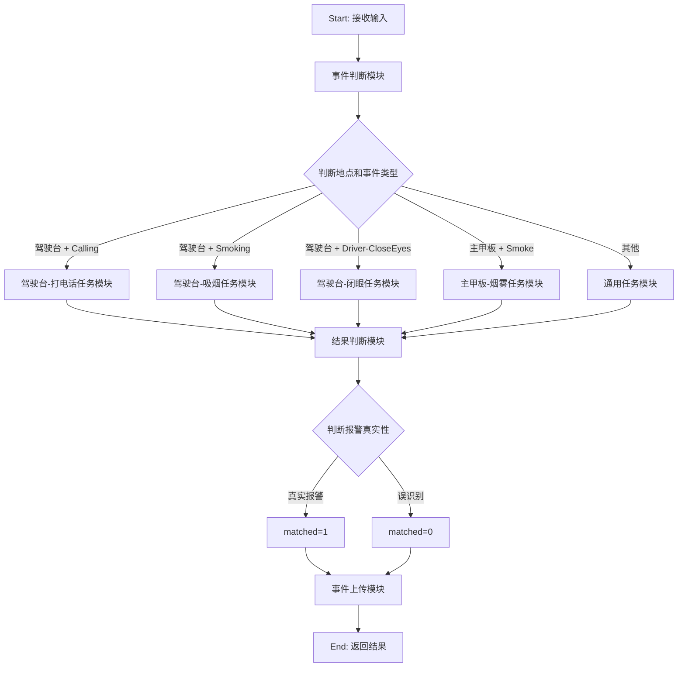
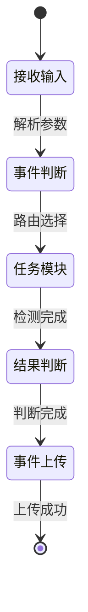
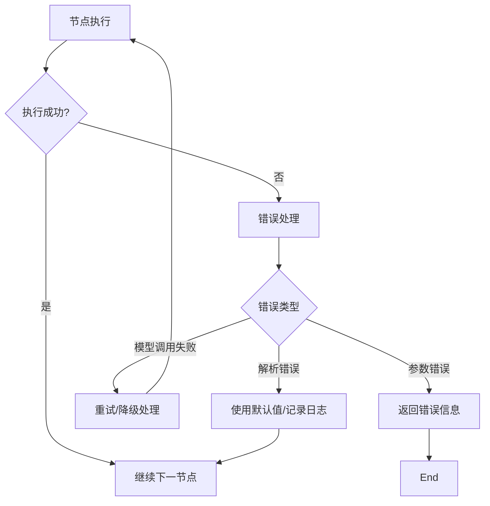

# 船舶报警识别Agent流程图设计

## 1. 整体流程图



## 2. 详细节点设计

### 2.1 事件判断模块

**输入**：
- video_event_record_id
- camera_name
- events_type
- snap_url

**处理逻辑**：
1. 解析输入参数
2. 验证参数有效性
3. 根据camera_name和events_type组合，确定路由路径

**输出**：
- 路由标识（location_event_key）
- 原始输入信息

### 2.2 任务模块（以驾驶台-打电话为例）

**输入**：
- snap_url（图片地址）
- events_type（Calling）

**处理逻辑**：
1. 构建多模态消息（文本+图片）
2. 使用结构化提示词，要求模型返回JSON格式
3. 调用AI模型进行分析
4. 解析返回的JSON结果

**提示词模板**：
```
你是一名专业的船舶安全监控分析专家。请分析以下图片，该图片来自船舶驾驶台的监控摄像头。

事件类型：打电话（Calling）

请仔细分析图片，并回答以下5个问题，返回JSON格式数据：

1. has_human_body（布尔值）：照片中是否检测到驾驶员的人体特征？
2. hand_holding_phone（布尔值）：驾驶员手部位置检测到手机物体？
3. phone_near_ear_or_face（布尔值）：手机是否靠近耳朵或脸部？
4. landline_telephone（布尔值）：是否是有线电话？
5. upper_body_fully_visible（布尔值）：驾驶员上半身特征可以清晰分辨吗？

另外，请提供：
- reason（字符串）：判断原因说明
- content（字符串）：图片内容简述（不考虑图片中的文字）

请严格按照以下JSON格式返回：
{
  "has_human_body": true/false,
  "hand_holding_phone": true/false,
  "phone_near_ear_or_face": true/false,
  "landline_telephone": true/false,
  "upper_body_fully_visible": true/false,
  "reason": "判断原因",
  "content": "图片简述"
}
```

**输出**：
- detection_result（JSON格式）

### 2.3 结果判断模块

**输入**：
- detection_result（检测结果JSON）
- events_type（事件类型）

**处理逻辑**：
1. 根据事件类型，加载对应的判断规则
2. 评估各检测条件的满足情况
3. 综合判断：matched = 1 或 0
4. 生成判断原因

**判断规则示例（Calling事件）**：
- 如果 `has_human_body` = true 且 `hand_holding_phone` = true 且 `phone_near_ear_or_face` = true，则 matched = 1
- 如果 `landline_telephone` = true，则 matched = 1（有线电话也算）
- 如果 `has_human_body` = false，则 matched = 0
- 其他情况根据综合评估

**输出**：
- matched（1或0）
- reason（判断原因）

### 2.4 事件上传模块

**输入**：
- 所有处理结果

**处理逻辑**：
1. 组装完整的结果数据
2. 调用上传工具/API
3. 记录上传状态

**输出**：
- 上传状态
- 完整结果数据

## 3. 状态流转图



## 4. 错误处理流程



## 5. 数据流图

```
输入数据流：
video_event_record_id, camera_name, events_type, snap_url
    ↓
事件判断模块（解析、验证、路由）
    ↓
任务模块（图片分析、AI检测）
    ↓
结果判断模块（规则评估、综合判断）
    ↓
事件上传模块（数据组装、上传）
    ↓
输出数据流：
完整分析结果（包含matched字段）
```

