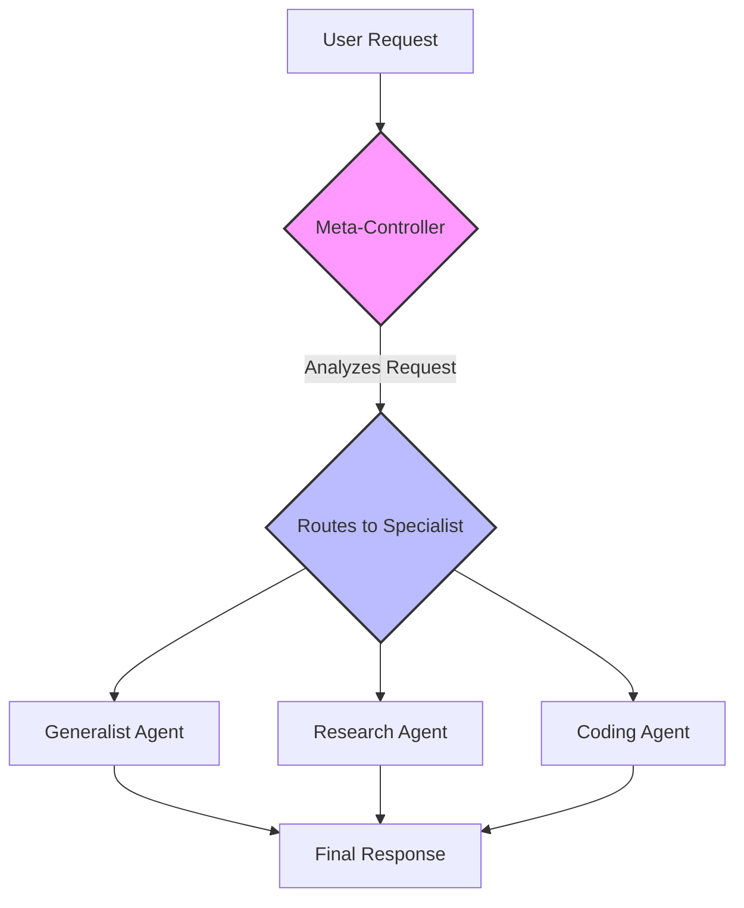

# All Agentic Architectures

     [](https://opensource.org/licenses/MIT)

Welcome to a comprehensive, hands-on masterclass in **modern AI agent design**. This repository contains detailed implementations of **17+ state-of-the-art agentic architectures**, built with LangChain and LangGraph. It is designed to be a living textbook, bridging the gap between theoretical concepts and practical, production-ready code.

## 📖 Why This Repository?

The field of AI agents is evolving at an incredible pace, but many resources remain abstract and theoretical. This project was created to provide a structured, practical, and deeply educational path for developers, researchers, and AI enthusiasts to master the art of building intelligent systems.

-   **From Theory to Tangible Code:** Each architecture is not just explained but implemented end-to-end in a runnable Jupyter notebook.
-   **Structured Learning Path:** The notebooks are ordered to build concepts progressively, from foundational patterns to highly advanced, multi-agent and self-aware systems.
-   **Emphasis on Evaluation:** We don't just build agents, we measure them. Most notebooks feature a robust `LLM-as-a-Judge` pattern to provide quantitative, objective feedback on an agent's performance, a critical skill for production AI.
-   **Real-World Scenarios:** The examples are grounded in practical applications—financial analysis, coding, social media management, medical triage—making the concepts immediately relevant.
-   **Consistent, Modern Framework:** By using `LangGraph` as the core orchestrator, you will learn a powerful, stateful, and cyclical approach to agent design that is rapidly becoming the industry standard.

---

## 🏛️ The Architectures: A Deep Dive

This collection covers the full spectrum of modern agentic design, from single-agent enhancements to complex, collaborative, and self-improving systems.

| # | Architecture | Core Concept / TL;DR | Key Use Case | Notebook |
|:---:|---|---|---|:---:|
| **01** | **Reflection** | Moves from a single-pass generator to a deliberate, multi-step reasoner by critiquing and refining its own work. | High-Quality Code Generation, Complex Summarization | [01_reflection.ipynb](./01_reflection.ipynb) |
| **02** | **Tool Use** | Empowers an agent to overcome knowledge cutoffs and interact with the real world by calling external APIs and functions. | Real-time Research Assistants, Enterprise Bots | [02_tool_use.ipynb](./02_tool_use.ipynb) |
| **03** | **ReAct** | Dynamically interleaves reasoning ("thought") and action ("tool use") in an adaptive loop to solve complex, multi-step problems. | Multi-hop Q&A, Web Navigation & Research | [03_ReAct.ipynb](./03_ReAct.ipynb) |
| **04** | **Planning** | Proactively decomposes a complex task into a detailed, step-by-step plan *before* execution, ensuring a structured and traceable workflow. | Predictable Report Generation, Project Management | [04_planning.ipynb](./04_planning.ipynb) |
| **05** | **Multi-Agent Systems** | A team of specialized agents collaborates to solve a problem, dividing labor to achieve superior depth, quality, and structure in the final output. | Software Dev Pipelines, Creative Brainstorming | [05_multi_agent.ipynb](./05_multi_agent.ipynb) |
| **06** | **PEV (Plan, Execute, Verify)** | A highly robust, self-correcting loop where a Verifier agent checks the outcome of each action, allowing for error detection and dynamic recovery. | High-Stakes Automation, Finance, Unreliable Tools | [06_PEV.ipynb](./06_PEV.ipynb) |
| **07** | **Blackboard Systems** | A flexible multi-agent system where agents collaborate opportunistically via a shared central memory (the "blackboard"), guided by a dynamic controller. | Complex Diagnostics, Dynamic Sense-Making | [07_blackboard.ipynb](./07_blackboard.ipynb) |
| **08** | **Episodic + Semantic Memory** | A dual-memory system combining a vector store for past conversations (episodic) and a graph DB for structured facts (semantic) for true long-term personalization. | Long-Term Personal Assistants, Personalized Tutors | [08_episodic_with_semantic.ipynb](./08_episodic_with_semantic.ipynb) |
| **09** | **Tree of Thoughts (ToT)** | Solves problems by exploring multiple reasoning paths in a tree structure, evaluating and pruning branches to systematically find the optimal solution. | Logic Puzzles, Constrained Planning | [09_tree_of_thoughts.ipynb](./09_tree_of_thoughts.ipynb) |
| **10** | **Mental Loop (Simulator)** | An agent tests its actions in an internal "mental model" or simulator to predict outcomes and assess risk before acting in the real world. | Robotics, Financial Trading, Safety-Critical Systems | [10_mental_loop.ipynb](./10_mental_loop.ipynb) |
| **11** | **Meta-Controller** | A supervisory agent that analyzes incoming tasks and routes them to the most appropriate specialist sub-agent from a pool of experts. | Multi-Service AI Platforms, Adaptive Assistants | [11_meta_controller.ipynb](./11_meta_controller.ipynb) |
| **12** | **Graph (World-Model Memory)** | Stores knowledge as a structured graph of entities and relationships, enabling complex, multi-hop reasoning by traversing connections. | Corporate Intelligence, Advanced Research | [12_graph.ipynb](./12_graph.ipynb) |
| **13** | **Ensemble** | Multiple independent agents analyze a problem from different perspectives, and a final "aggregator" agent synthesizes their outputs for a more robust, less biased conclusion. | High-Stakes Decision Support, Fact-Checking | [13_ensemble.ipynb](./13_ensemble.ipynb) |
| **14** | **Dry-Run Harness** | A safety-critical pattern where an agent's proposed action is first simulated (dry run) and must be approved (by a human or checker) before live execution. | Production Agent Deployment, Debugging | [14_dry_run.ipynb](./14_dry_run.ipynb) |
| **15** | **RLHF (Self-Improvement)** | An agent's output is critiqued by an "editor" agent, and the feedback is used to iteratively revise the work. High-quality outputs are saved to improve future performance. | High-Quality Content Generation, Continual Learning | [15_RLHF.ipynb](./15_RLHF.ipynb) |
| **16** | **Cellular Automata** | A system of many simple, decentralized grid-based agents whose local interactions produce complex, emergent global behavior like optimal pathfinding. | Spatial Reasoning, Logistics, Complex System Simulation | [16_cellular_automata.ipynb](./16_cellular_automata.ipynb) |
| **17** | **Reflexive Metacognitive** | An agent with a "self-model" that reasons about its own capabilities and limitations, choosing to act, use a tool, or escalate to a human to ensure safety. | High-Stakes Advisory (Medical, Legal, Finance) | [17_reflexive_metacognitive.ipynb](./17_reflexive_metacognitive.ipynb) |

---

## 🗺️ A Guided Tour Through the Architectures

The repository is structured to take you on a journey from simple enhancements to building truly sophisticated, multi-agent, self-aware systems.

<details>
<summary><b>Click to expand the learning path</b></summary>

#### Part 1: Foundational Patterns (Notebooks 1-4)
This section covers the essential building blocks for making a single agent more powerful.
- We start with **Reflection** to improve output quality.
- Then, we give the agent **Tools** to interact with the world.
- **ReAct** combines these into a dynamic loop.
- Finally, **Planning** adds foresight and structure to its actions.

#### Part 2: Multi-Agent Collaboration (Notebooks 5, 7, 11, 13)
Here, we explore how to make agents work together.
- **Multi-Agent Systems** introduces the concept of specialized teams.
- The **Meta-Controller** acts as a smart router to dispatch tasks to these teams.
- The **Blackboard** provides a flexible, shared workspace for dynamic collaboration.
- The **Ensemble** pattern uses multiple agents in parallel for more robust, diverse analysis.

#### Part 3: Advanced Memory & Reasoning (Notebooks 8, 9, 12)
This section focuses on how agents can think more deeply and remember what they've learned.
- **Episodic + Semantic Memory** provides a powerful, human-like memory system.
- The **Graph World-Model** allows for complex reasoning over interconnected knowledge.
- **Tree of Thoughts** enables systematic, multi-path exploration to solve hard logic problems.

#### Part 4: Safety, Reliability, and Real-World Interaction (Notebooks 6, 10, 14, 17)
These architectures are critical for building agents that can be trusted in production.
- The **Dry-Run Harness** provides a crucial human-in-the-loop safety layer.
- The **Simulator** allows an agent to "think before it acts" by modeling consequences.
- **PEV** builds in automatic error detection and recovery.
- The **Metacognitive** agent understands its own limitations, a key to safe operation in high-stakes domains.

#### Part 5: Learning and Adaptation (Notebooks 15, 16)
The final section explores how agents can improve over time and solve problems in novel ways.
- The **Self-Improvement Loop** creates a mechanism for an agent to learn from feedback, analogous to RLHF.
- **Cellular Automata** showcases how complex global behavior can emerge from simple, local rules, creating highly adaptive systems.

</details>

<details>
<summary><b>Example Architecture Diagram: The Meta-Controller</b></summary>

This diagram illustrates the flow in the `11_meta_controller.ipynb` notebook, a common pattern for orchestrating specialized agents.


</details>

---

## 🛠️ Technical Stack & Setup

This project leverages a modern, powerful stack for building sophisticated AI applications.

| Component | Purpose |
|---|---|
| **Python 3.10+** | The core programming language for the entire project. |
| **LangChain** | Provides the foundational building blocks for interacting with LLMs and tools. |
| **LangGraph** | The key orchestration framework for building complex, stateful, and cyclical agent workflows. |
| **Nebius AI Models** | High-performance LLMs (e.g., `Mixtral-8x22B-Instruct-v0.1`) that power the agents' reasoning. |
| **Jupyter Notebooks** | Used for interactive development, rich explanations, and clear, step-by-step demonstrations. |
| **Pydantic** | Ensures robust, structured data modeling, which is critical for reliable communication with LLMs. |
| **Tavily Search** | A powerful search API used as a tool for research-oriented agents. |
| **Neo4j** | The industry-standard graph database used for implementing semantic and world-model memory. |
| **FAISS** | An efficient vector store used for implementing episodic memory through similarity search. |

## 🚀 Getting Started

Follow these steps to set up your local environment and run the notebooks.

### 1. Clone the Repository

```bash
git clone https://github.com/your-username/all-agentic-architectures.git
cd all-agentic-architectures
```

### 2. Set Up a Virtual Environment

It is highly recommended to use a virtual environment to manage dependencies.

```bash
# For Unix/macOS
python3 -m venv venv
source venv/bin/activate

# For Windows
python -m venv venv
.\venv\Scripts\activate
```

### 3. Install Dependencies

Install all the required Python packages from the `requirements.txt` file.

```bash
pip install -r requirements.txt
```

To visualize graphs in LangGraph, you may also need to install `pygraphviz`.

### 4. Configure Environment Variables

The agents require API keys to function. Create a file named `.env` in the root of the project directory. You can copy the provided `requirements.txt` content to see what's needed and then create your `.env` file.

Open the `.env` file and add your credentials. It should look like this:

```python
# .env file

# Nebius AI API Key (for LLM access)
NEBIUS_API_KEY="your_nebius_api_key_here"

# LangSmith API Key (for tracing and debugging)
LANGCHAIN_API_KEY="your_langsmith_api_key_here"
LANGCHAIN_TRACING_V2="true"
LANGCHAIN_PROJECT="All-Agentic-Architectures" # Optional: Set a project name

# Tavily Search API Key (for the Research agent's tool)
TAVILY_API_KEY="your_tavily_api_key_here"

# Neo4j Credentials (for Graph and Memory architectures)
# You must have a Neo4j instance running (e.g., via Docker or Neo4j Desktop)
NEO4J_URI="bolt://localhost:7687"
NEO4J_USERNAME="neo4j"
NEO4J_PASSWORD="your_neo4j_password_here"
```

### 5. Run the Notebooks

You can now launch Jupyter and explore the notebooks in numerical order.

```bash
jupyter notebook
```

## 🤝 How to Contribute

Contributions are what make the open-source community such an amazing place to learn, inspire, and create. Any contributions you make are **greatly appreciated**.

1.  **Fork the repository.**
2.  **Create a new branch** for your feature or bug fix (`git checkout -b feature/new-architecture` or `bugfix/fix-typo`).
3.  **Make your changes.** Please ensure the code is well-commented and the notebook explanations are clear.
4.  **Submit a pull request** with a detailed description of your changes.

You can also open an issue to report a bug, suggest an enhancement, or propose a new architecture to add to the collection.

## 📄 License

This project is licensed under the MIT License. See the [LICENSE](LICENSE) file for details.